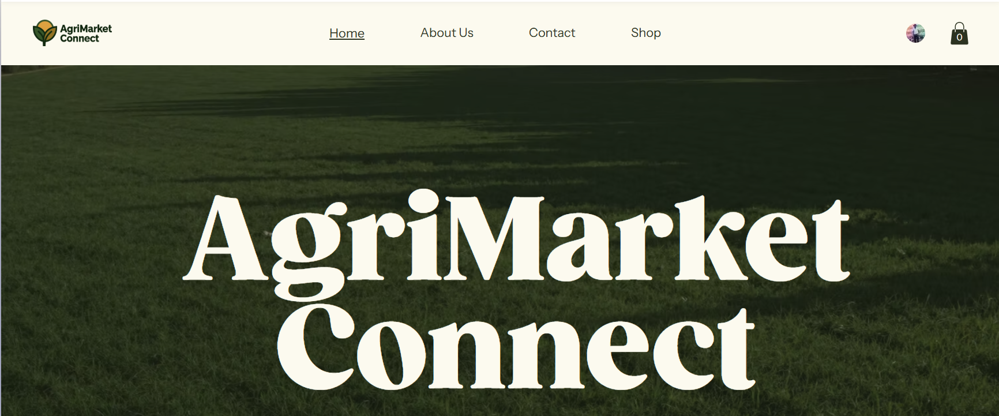
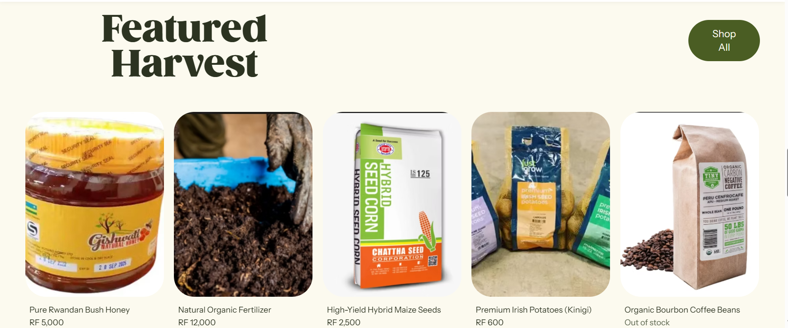
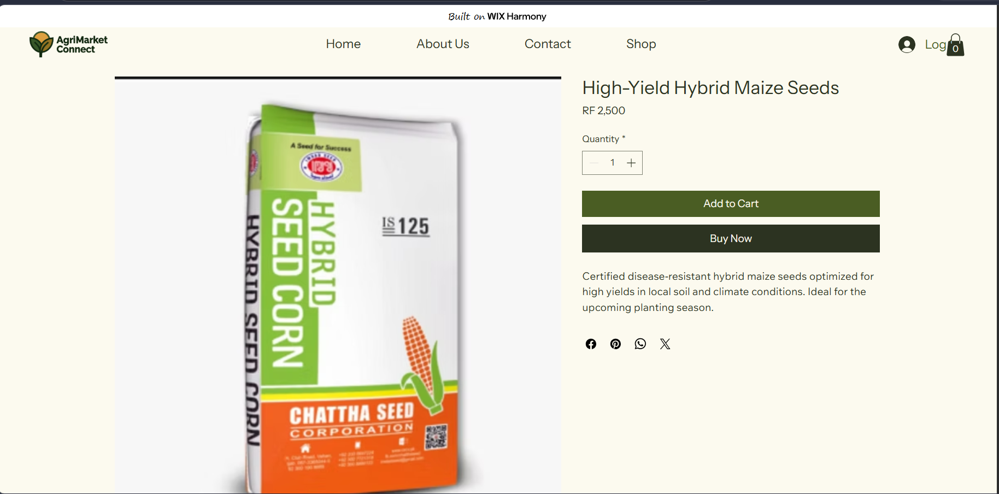
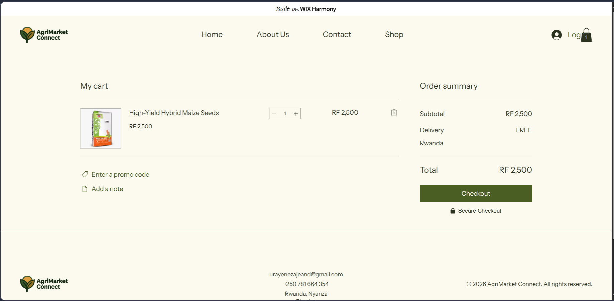
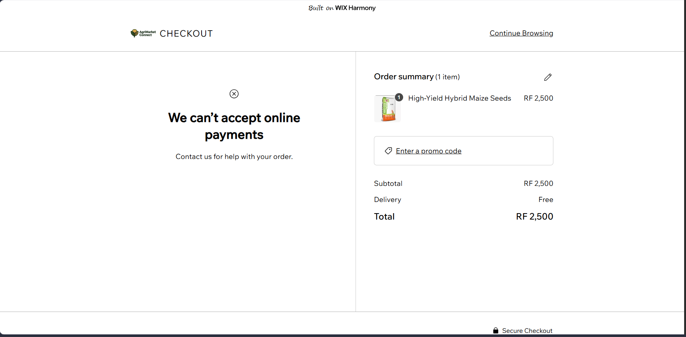
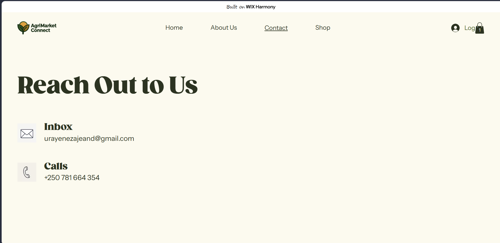

# Agrimarket Connect - No-Code E-Commerce Application

## Student Information
* **Name:** URAYENEZA Jean De Dieu
* **Registration Number:** 21068/2023
* **Course:** E-Commerce And Web Application (EWA408510)
* **Group:** Weekend Nyanza

## Project Links
* **Live Website:** https://urayenezajeand.wixsite.com/agrimarket-connect
* **GitHub Repository:** https://github.com/urayenezajeand/agrimarket

## Platform Used
* Wix (No-Code Builder)

## Features Implemented
* **Homepage:** Custom hero section with a welcome message and clear navigation.
* **Product Catalog:** A localized agricultural shop featuring a minimum of 5 products with images, prices, and descriptions.
* **About Us:** A dedicated section outlining the mission to empower local growers through fair trade.
* **Contact Details:** Dedicated contact page providing localized support information (email and phone).
* **Cart Functionality:** Interactive shopping cart allowing users to add products and simulate checkout.

## Screenshots
*(Note: Images are stored in the `images/` directory)*

### Homepage Welcome

### Product Listing (Minimum 5 Products)

### Single Product & Add to Cart

### Cart Interaction

### checkout

### Contact Page

## Challenges
* Adapting a pre-built template to fit a localized Rwandan agricultural context while maintaining a clean, professional aesthetic.
* Ensuring the visual hierarchy (typography and spacing) felt humanized and approachable rather than rigidly corporate.

## Lessons Learned
* No-code platforms like Wix drastically reduce deployment time for frontend interfaces, allowing developers to focus heavily on UI/UX and branding.
* High-quality, consistent imagery is essential for establishing trust in an e-commerce environment.
